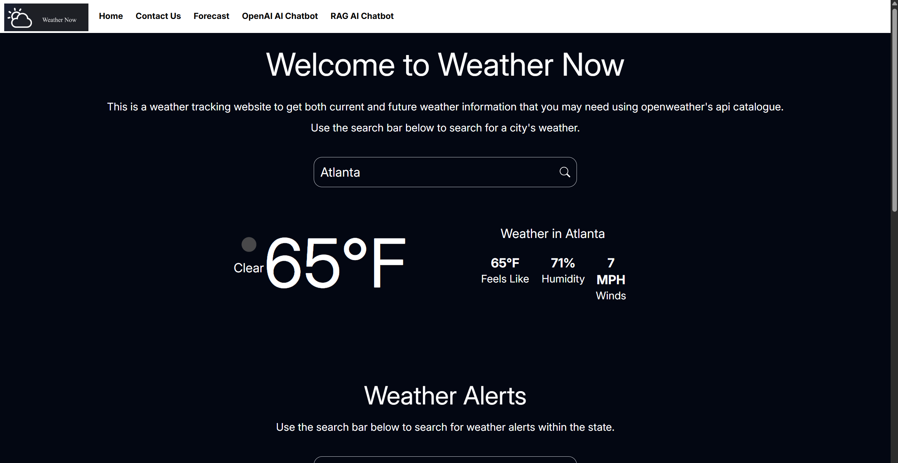
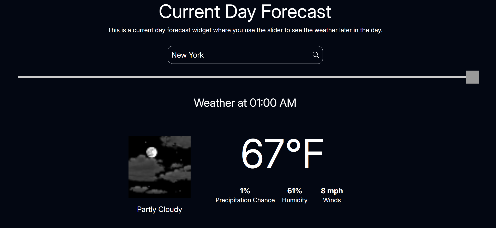
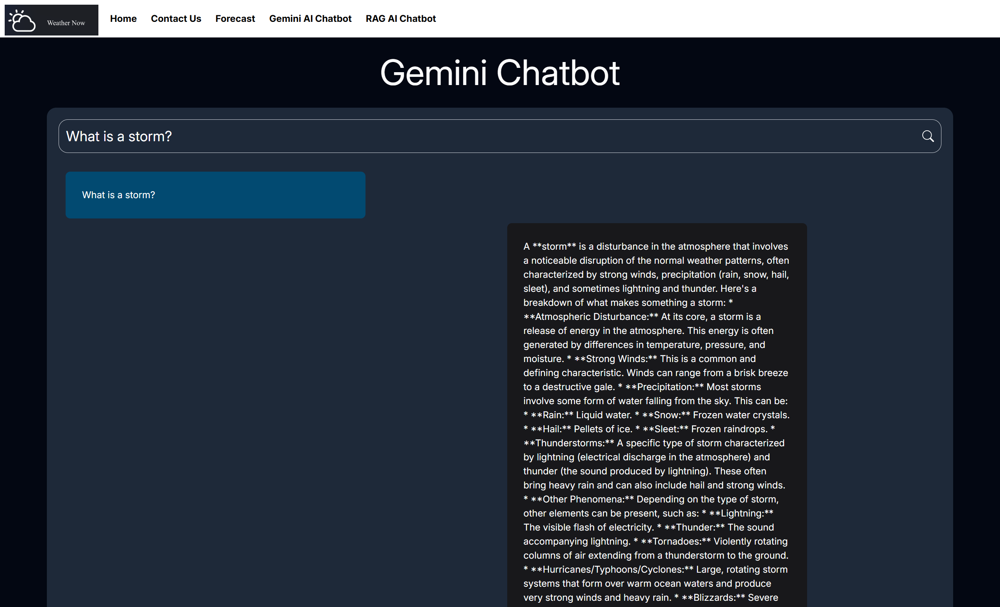

# WeatherNow Website
A React Router-based website that can be used to get information on the weather.

---

## Screens & Demo  
  
  
  

## Visiting the Website
You can visit the link  https://weather-now-plqx.vercel.app to access the latest production build of the website.

---

## Features (What You’ll See)  
- Search bar to find weather information by calling the OpenWeather API
- Search bar to create a weather widget to find the weather during certain times
- Creation of a Google Gemini chatbot and a Retrieval-augmented generation model-based chatbot

---

## Tech Stack  
- **Language**: Typescript, CSS, Python
- **Frameworks**: Bootstrap
- **IDE**: Visual Studio Code, PyCharm
- **Frontend**: React Router
- **Backend**: Django
- **Database**: PostgreSQL

---

## Setup (Run in 2 Minutes)  
1. Clone the repository:  
   ```bash
   git clone https://github.com/SumukhP-dev/Weather_Now_Website.git
   ```
2. Run 
   ```bash
   npm install --legacy-peer-deps
   ```
   in terminal
3. Run 
   ```bash
   react-router dev
   ```
   in terminal

---

## License & Contact  
**License:** MIT  

**Author:** Sumukh Paspuleti
- [LinkedIn](https://www.linkedin.com/in/sumukh-paspuleti/)  
- [Email](mailto:spaspuleti3@gatech.edu)  
